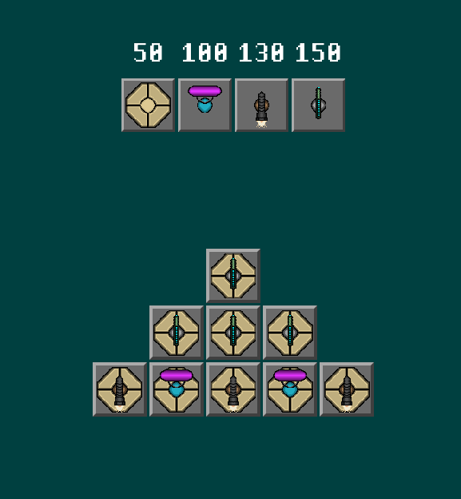
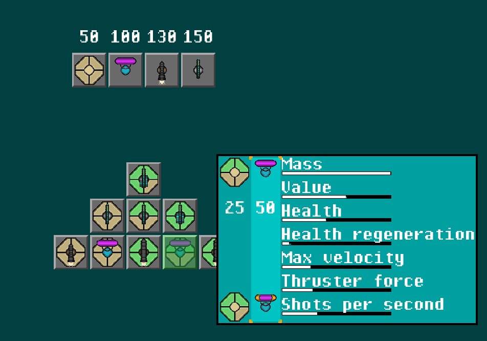
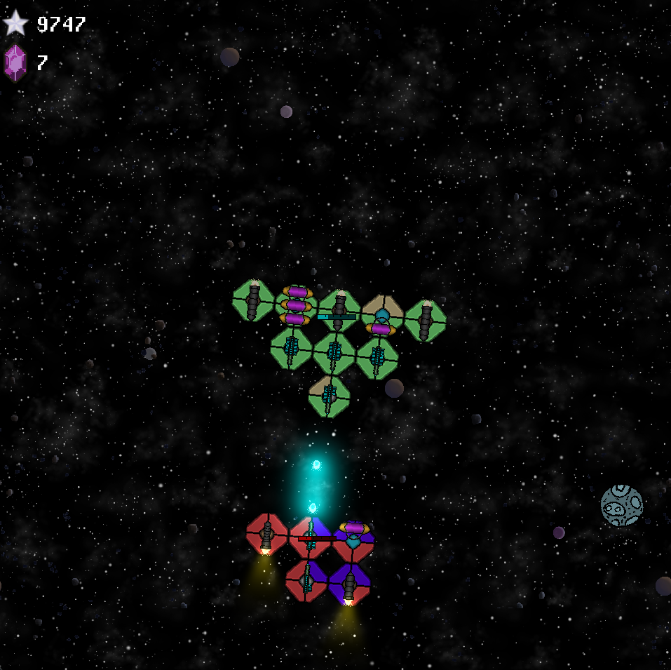

# INF112 Project - *Sprite*

* Team: *Happy sprites*: *Tor Wollmann, Torstein Andvik, Flemming Bjørdal, Henrik
  Dalstø*
* A complete UML diagram, kept uptdated, [is found here](./doc/umlDiagram.png). (NOTE: This file
  will eat all you memory!)

## About the game

* You are an alien explorer in deep space. Your ship is in constant peril from enemy ships and
  meteors. Where are you going? You don't know. A vast expanse is before you in any direction.
  Defeat enemy ships, destroy asteroids, and get upgrades. These will all help you survive, but for
  what purpose?

<table>
  <tr>
    <th>Build Your Ship</th>
    <th>Upgrade Components</th>
    <th>Fight Enemies</th>
  </tr>
  <tr>
    <td></td>
    <td></td>
    <td></td>
  </tr>
</table>

## Controls

You control the game with the usual WASD.

- `W`: Go forward
- `S`: Go backwards
- `A` and `D` rotates the ship.
- `P`: Pauses the game, and pulls up the options menu.
- `Space`: Shoots lasers
- `Esc`: shows the upgrade menu. You drag and drop upgrades on your ship.

An options menu lists all controls for every menu once in game. Just click options, or push `p`.

## How to run

Compile and run the program with `mvn compile exec:java`

* On subsequent runs, you only need `mvn exec:java`

* Requires Java 21 or later

## Known errors

Some resizing issues.

## Credits

- Arts: Flemming Bjørdal, Torstein Andvik
- Music: Henrik Dalstø

## Jar Files

If you run `mvn package` you get everything bundled up into a `.jar` file + a ‘fat’ Jar file where
all the necessary dependencies have been added:

* `target/NAME-VERSION.jar` – your compiled project, packaged in a JAR file
* `target/NAME-VERSION-fat.jar` – your JAR file packaged with dependencies

Run Jar files with, for example, `java -jar target/NAME-VERSION-fat.jar`.

If you have test failures, and *really* need to build a jar anyway, you can skip testing with
`mvn -Dmaven.test.skip=true package`.
